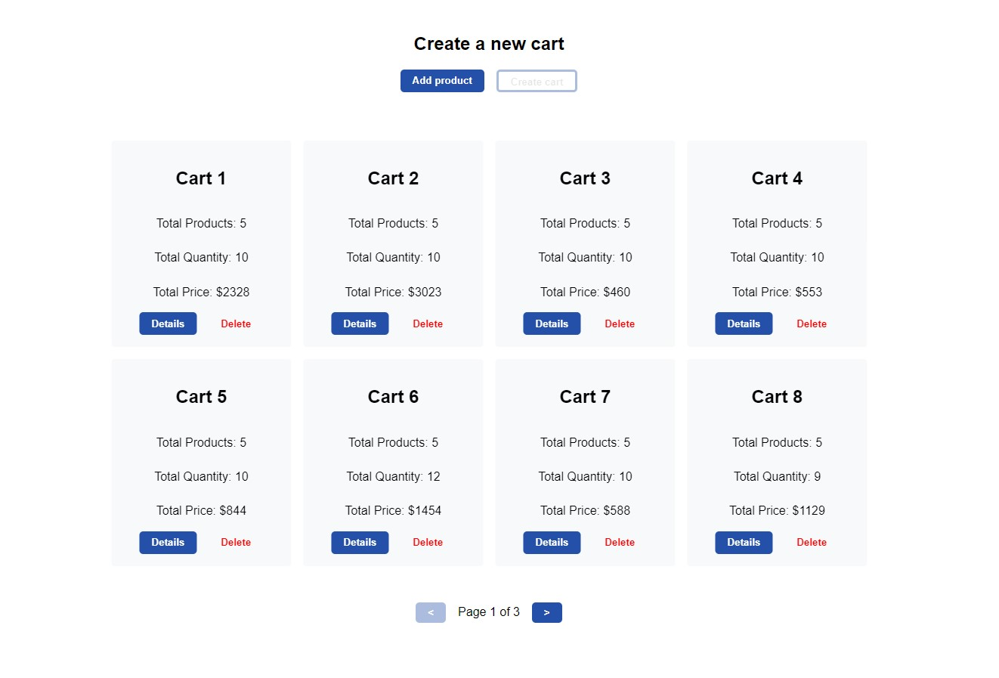

# Dashboard Application

[](https://reactjs.org/)
[](https://www.typescriptlang.org/)
[](hhttps://recharts.org/en-US/)
[](https://mui.com/)
[](https://testing-library.com/)

A simple dashboard application built using React 18, TypeScript 4, and MUI 5. The app features a dashboards with shopping carts containing mock data from the following API: https://dummyjson.com/docs/carts. The `CartDetails` component has been tested using React Testing Library. All components, except for `Skeleton` and `CircularProgress`, were written from scratch.



## Demo Link

Acess the app at https://dashboard-app.wozniakkamil.com

## Table of Contents

- [Features](#features)
- [Installation](#installation)
- [Usage](#usage)

## Features

- View a list of all carts.
- Add and remove carts.
- Select a specific cart to view the price of each product in the cart, as well as its discounted price. This information is presented in a chart.
- Pagination for the list of carts.
- Error handling of API calls.
- Simple, user-friendly interface with animations.
- Fully responsive design.

## Installation

To get started, clone the repository and install the dependencies:

```bash
git clone https://github.com/WoXuS/dashboard-app
cd dashboard-app
npm install
```

## Usage

To start the development server, run:

```bash
npm start
```

Open http://localhost:3000 to view the registration module in your browser.
